# Rock Paper Scissors

Paper Rock Scissors is a site that hopes to demonstrate how pure JavaScript works in a real-world context. The site will be targeted toward people who not only love to implement more advanced JavaScript concepts but also plying a game. Rock Paper Scissors is a fully responsive JavaScript choice game that will allow users to choose your game option, user your own username, compete with the computer random choice, and have fun.

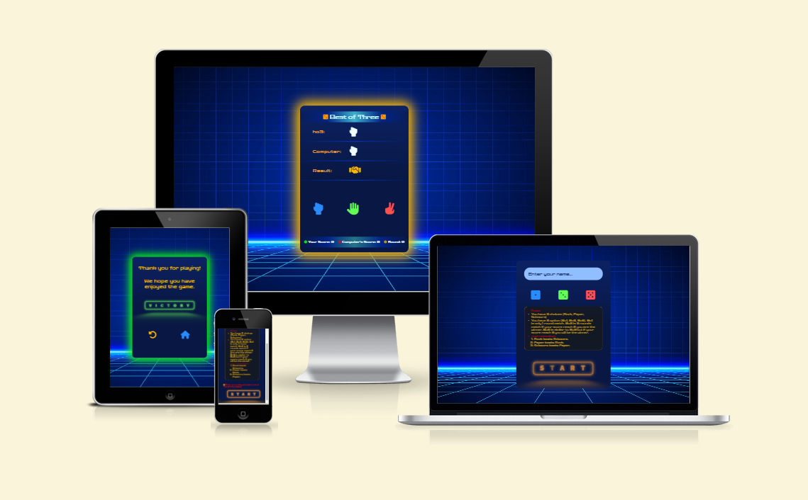

## Features

Rock Paper Scissors has three views that includes Starting view, Matching view, and Ending view.

Starting view, ables you to choose your username, match option, and some information about the rules of the game.

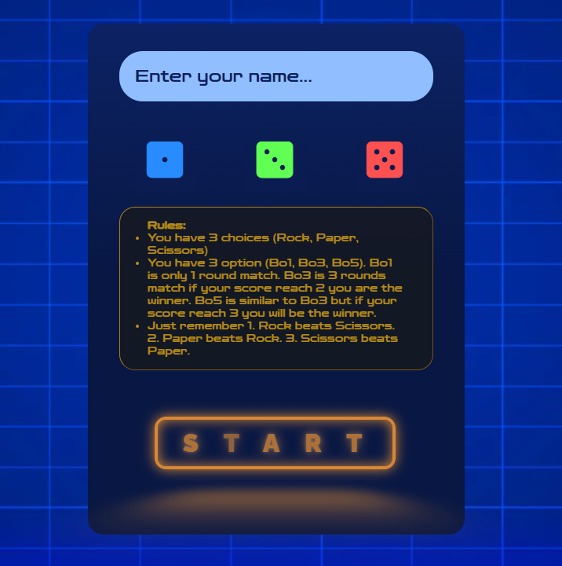

Matching view, makes you to compete with computer by the following rules.

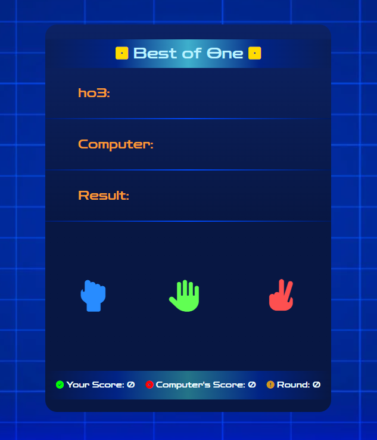

Ending view, announces that you have won or lost the game and gives you two options, return to the main menu which resets the whole game and rematch to let you play the game with the username and match option that you had chosen.

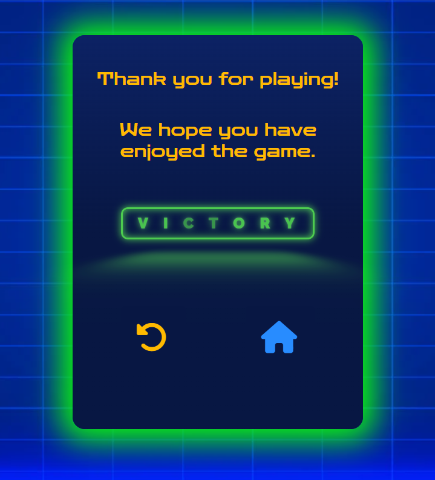

### Existing Features

- __Starting view features__

  - Featured at the top of the strating view page, the area field for you to choose your username.

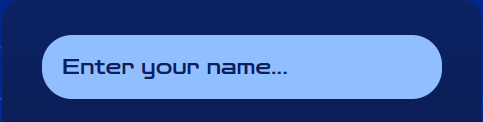

  - After choosing your username you have three options which are Best of One (The player or the computer have one chance to win or lose the game.), Best of Three (The player or the computer have three chances to win the or lose the game.), Best of Five (The player or the computer have five chances to win or lose the game.).

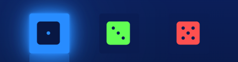

  - There is a text field to let you know about the rules of the game.

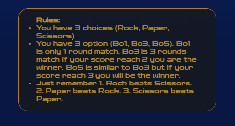

  - After choosing your username and the match option by clicking the Start button you port to the Matching view of the game.

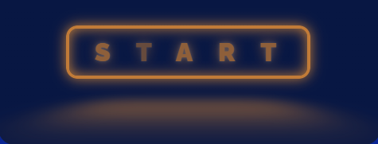

- __Matching view features__

  - In this view you can see the match option that you have chosen on the top of the page.

  - There is a field you can see your chose, computer choice, and the result of the round by their icons and a nice light respecting the result.

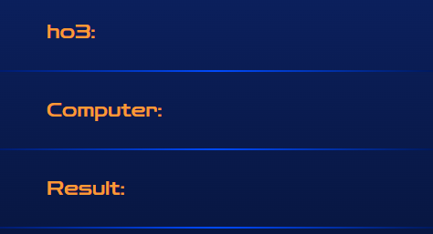

  - You can track your score, computer score, and the round counter that count the rounds which has a winner, either you or computer.

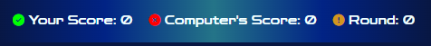

- __Ending view features__

  - After finishing the game you port to the ending view and at the top of the page there will be a thanks message.

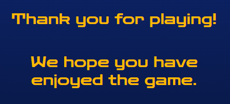

  - Underneath of the the thanks message you can see that you were the winner or the loser.

  - In addition, you may also have two choices to return to the main menu (Starting view) or rematch the game with the same match option and username (Matching view).

## Testing

### Validator Testing

- HTML
  
- CSS
  
- JavaScript
  

### Unfixed Bugs

## Deployment

## Credits

### Content

### Media
